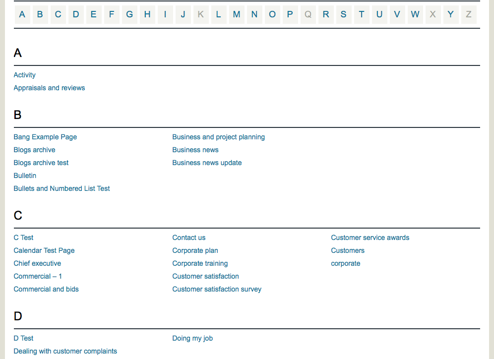
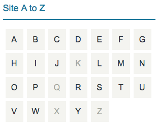

# AlphaListing #

**Contributors:** [eslin87](https://profiles.wordpress.org/eslin87/)  
**Tags:** a to z, a-z, index, listing, widget  
**Requires at least:** 5.0  
**Requires PHP:** 8.0  
**Tested up to:** 6.7  
**Stable tag:** 4.3.5  
**License:** GPLv2 or later  
**License URI:** http://www.gnu.org/licenses/gpl-2.0.html  

Provides an A to Z index page and widget. 

## Description ##

Display posts, pages, and terms alphabetically in a Rolodex-, catalog-, or directory-style list with the AlphaListing plugin!  

This plugin includes a block and shortcode for the list, along with a widget for linking to the list from any location on a site. If a letter has no associated pages, the widget will display the letter unlinked, while the list page will omit the letter entirely.  

Show posts from any single or multiple post types, including built-in posts and pages. Post types from plugins like WooCommerce products are also supported. Alternatively, display terms such as categories or tags.

**This plugin is based on the original A-Z Listing by Lucy (formerly Dani) Llewellyn, which is no longer maintained. Using a custom template is not guaranteed to continue working. For the latest example of the template, see the [example template](https://raw.githubusercontent.com/Lin87/alphalisting/refs/heads/main/templates/a-z-listing.example.php).**

## Installation ##

This section describes how to install the plugin and get it working.

### Requirements ###

1. PHP 8.0 or higher is required.
1. The plugin requires mbstring to be enabled in the PHP installation. Without this feature, the plugin may behave unexpectedly or fail.

### Instructions ###

1. Upload the `alphalisting` folder to the `/wp-content/plugins/` directory.
1. Activate the plugin through the "Plugins" menu in WordPress.
1. Use the AlphaListing block in the (Gutenberg) block editor or the `[alphalisting]` shortcode on the desired page or post.
1. (Optional) Add the A-Z Site Map widget to a sidebar.

## Gutenberg Block ##

Use the AplhaListing block in most cases, as it provides guidance for configuring various options.

## Shortcode for compatibility and PHP use ##

The plugin provides a shortcode for the full AlphaListing, enabling use without modifying theme templates.

Basic usage is as follows:

    [alphalisting]

To specify a post-type to display instead of `page` then use, e.g. `post`:

    [alphalisting display="posts" post-type="post"]

To filter the posts by a term from a taxonomy:

    [alphalisting display="posts" post-type="post" taxonomy="category" terms="my-term-slug"]

To display pages that are direct children of the page with ID `24`:

    [alphalisting display="posts" post-type="page" parent-post="24"]

To display pages that are children of any depth below the page with ID `24`:

    [alphalisting display="posts" post-type="page" parent-post="24" get-all-children="yes"]

To show terms from a taxonomy instead of posts and pages, e.g. Terms from the `Categories` taxonomy:

    [alphalisting display="terms" taxonomy="category"]

To show terms from the `Categories` taxonomy that are direct children of the term with ID of `42`:

    [alphalisting display="terms" taxonomy="category" parent-term="42"]

To show terms from the `Categories` taxonomy that are children of any depth in the tree below the term with ID of `42`:

    [alphalisting display="terms" taxonomy="category" parent-term="42" get-all-children="yes"]

To override the alphabet used by the plugin:

    [alphalisting display="posts" alphabet="Aa,Bb,Cc,Dd,Ee,Ff,Gg,Hh,Ii,Jj,Kk,Ll,Mm,Nn,Oo,Pp,Qq,Rr,Ss,Tt,Uu,Vv,Ww,Xx,Yy,Zz"]

To add numbers to the listing:

    [alphalisting display="posts" numbers="after"]

The numbers can also be shown before the alphabet:

    [alphalisting display="posts" numbers="before"]

Group the numbers into a single collection for all posts beginning with a numeral.:

    [alphalisting numbers="after" group-numbers="yes"]

To group the alphabet letters into a range:

    [alphalisting grouping="3"]

**The arguments are all optional.**

### Common options ###

* `display`: specifies whether to display posts or terms from a taxonomy.
  * Default value: `posts`.
  * May only contain one value.
  * Must be set to either `posts` or `terms`.
  * Any value other than `posts` or `terms` will default to displaying posts.
* `numbers`: appends or prepends numerals to the alphabet.
  * Default value: `unset`.
  * May only contain one value.
  * Must be set to either `before` or `after`.
  * Any value other than `before` or `after` will default to **appending** numerals to the alphabet.
* `grouping`: tells the plugin if and how to group the alphabet.
  * Default value: `unset`.
  * May only contain one value.
  * Must be set to any positive number greater than `1` or the value `numbers`.
  * Any value other than a positive number or the value `numbers` will default to disabling all grouping functionality.
  * When set to a number higher than `1` the listing will group letters together into ranges.
    * For example, choosing `3` groups the Latin alphabet so that `A`, `B`, and `C` become `A-C`, followed by `D-F`, `G-I`, and so on.
    * When using this setting, if numbers are also shown via the `numbers="before"` or `numbers="after"` attribute then they will be shown as a single separate group `0-9`.
  * When set to the value `numbers` it will group numerals into a single group `0-9`.
    * This requires the numbers to be displayed via the `numbers="before"` or `numbers="after"` attributes.
* `group-numbers`: tells the plugin to group all items beginning with a numeral into a single collection.
  * Default value: `false`.
  * May only contain one value.
  * Must be set to `true`, `yes`, `on`, or `1` to group items beginning with a numeral in a single collection. All other values will keep the default behaviour.
* `symbols-first`: Tells the plugin to put the unknown alphabet letter (symbols) group before the main alphabet.
  * Default value: `false`.
  * May only contain one value.
  * Must be set to `true`, `yes`, `on`, or `1` to put the symbols group before the alphabet. All other values will keep the default behaviour.
* `alphabet`: overrides the alphabet used by the plugin..
  * Default value: `unset`.
  * If this attribute is not defined, the plugin uses either the untranslated default or a translation from [glotpress](https://translate.wordpress.org/projects/wp-plugins/alphalisting) if available for the site's language, as set in `Admin -> Settings -> Site` Language.
  * The current untranslated default is: `AÁÀÄÂaáàäâ,Bb,Cc,Dd,EÉÈËÊeéèëê,Ff,Gg,Hh,IÍÌÏÎiíìïî,Jj,Kk,Ll,Mm,Nn,OÓÒÖÔoóòöô,Pp,Qq,Rr,Ssß,Tt,UÚÙÜÛuúùüû,Vv,Ww,Xx,Yy,Zz`.
  * Accepts a single line of letters/symbols, which need to be separated via the comma character `,`.
  * Including more than one letter/symbol in each group will display posts starting with any of those under the same section.
  * The first letter or symbol in each group serves as the group's heading when displayed on the site.

### Posts options ###

* `post-type`: sets the listing to show a specific post-type.
  * Default value: `page`.
  * Multiple post-types may be specified by separating with commas (`,`) e.g. `post-type="page,post"`.
  * Must be the `slug` of the post-type(s).
* `parent-post`: sets the parent post that all displayed posts must be descended from.
  * Default value: `unset`.
  * May only contain one value.
  * Must be the `ID` of the parent post.
  * Add `get-all-children="yes"` to also include all descendants of any depth below the parent post.
* `exclude-posts`: remove these posts from the list.
  * Default value: `unset`.
  * Multiple posts may be specified by separating by commas: `,`.
  * Must be the `ID` of the post(s).
* `taxonomy`: sets the taxonomy containing the terms specified in the `terms=""` option.
  * Default value: `unset`.
  * May only contain one value.
  * Must be the `slug` of the taxonomy.
* `terms`: sets the taxonomy terms for filtering posts.
  * Default value: `unset`.
  * The taxonomy must also be specified in `taxonomy`.
  * Multiple terms may be specified by separating with commas: `,`.
  * Must be the `slug` of the term(s).

### Terms options ###

* `taxonomy`: sets the taxonomy to display terms from in the listing.
  * Default value: `unset`.
  * Multiple taxonomies may be specified by separating with commas: `,`.
  * Must be the `slug` of the taxonomy.
* `terms`: sets the taxonomy terms to include in the listing.
  * Default value: `unset`.
  * The taxonomy must also be specified in `taxonomy`.
  * Multiple terms may be specified by separating with commas: `,`.
  * Must be the `ID` of the term(s).
  * Cannot be used with `exclude-terms=""`.
* `exclude-terms`: sets the terms to exclude from display.
  * Default value: `unset`.
  * The taxonomy must also be specified in `taxonomy`.
  * Multiple terms may be specified by separating with commas: `,`.
  * Must be the `ID` of the term(s).
  * Cannot be used with `terms=""`.
* `parent-term`: set the parent that all displayed terms must be descended from.
  * Default value: `unset`.
  * May only contain one value.
  * Must be the `slug` of the parent term.
  * Add `get-all-children="yes"` to also include all descendants of any depth below the parent term.
* `get-all-children`: when a parent term is chosen this option is used to show all children of any depth or only direct children.
  * Default value: `false`.
  * May only contain one value.
  * Must be set to `true`, `yes`, `on`, or `1` to include all children of any depth. Any value other will use the default behaviour of only showing direct children.
* `hide-empty-terms`: hide terms that have no posts associated.
  * Default value: `false`.
  * May only contain one value.
  * Must be set to `true`, `yes`, `on`, or `1` to hide the empty terms. Any other value will use the default behaviour of showing all terms.

### Internal-use options for completeness ###

**These are intended for internal use by the plugin and should not require any modifications.**

* `target`: the default target for a listing that doesn't show any items.
  * Default value: `unset`.
  * May only contain one value.
  * Must be set to a URL which will be used as the target for the letters' hyperlinks.
* `return`: what type of listing to show, either `listing` or `letters`.
  * Default value: `listing`.
  * May only contain one value.
  * Must be set to either `listing` to display the default view, or `letters` to show only the letters without any items (posts or terms).

## PHP (expert) ##

### Most compatible method ###

The best way to use the plugin from PHP is to call `do_shortcode( '[alphalisting]' );` and save or `echo` the returned text. The parameter passed to `do_shortcode()` should be a complete AlphaListing shortcode with parameters as above.

## Multiple Column Output ##

Multiple column layout is the default on wide screens. A letter's group of items must contain at least 15 items to create two or more columns. This is to provide a more aesthetically pleasing view when a list is short with only a few items.

## Templates and Theming ##

The plugin allows the site owner, developer, or themer to provide custom templates for the AlphaListing output.

To add a template to a theme, create a file similar to `templates/a-z-listing.php` from the plugin folder. Place the copy in the theme's root directory and name it `a-z-listing.php` or `a-z-listing-section.php` (with `-section` as an optional top-level page slug for the section-targeting feature).

### The Loop ###

The theme system this plugin implements is *very* similar to [the standard WordPress loop](https://codex.wordpress.org/The_Loop), with a few added bits.

Important functions to include in the template are:

* `$a_z_query->the_letters()` prints the full alphabet, and links the letters that have posts to their section within the index page.
* `$a_z_query->have_letters()` returns true or false depending on whether there are any letters left to loop-through. This is part of the Letter Loop.
* `$a_z_query->have_items()` behaves very similarly to Core's `have_posts()` function. It is part of the Item Loop.
* `$a_z_query->the_letter()` similar to Core's `the_post()`, this will set-up the next iteration of the AlphaListing's Letter Loop. This needs to wrap-around the Item Loop.
* `$a_z_query->the_item()` similar to Core's `the_post()`, this will set-up the next iteration of the AlphaListing's Item Loop, the same way the normal WordPress Loop works. This needs to be _within_ the Letter Loop.

Within the Item Loop, all built-in WordPress Core post-related functions, such as `the_content()`, can be used. Titles and permalinks have helper functions to accommodate AlphaListing's display of taxonomy terms (see the next section).

Starting with a copy of the [default template](https://raw.githubusercontent.com/Lin87/alphalisting/refs/heads/main/templates/a-z-listing.example.php) is recommended when creating a custom version. The provided template demonstrate the usage of most functions available in the plugin.

### Helper functions ###

The plugin supports displaying taxonomy terms as though each term were a post. This means that the WordPress functions related to posts such as `the_title()` and `the_permalink()` are unreliable. We have therefore added helper functions which will return or print the correct output for the item.

These helper functions cope with the dual usage of the plugin supporting both `WP_Query`-based (returning `WP_Post` objects) and Taxonomy Terms (returning `WP_Term` objects) listings. These are:

* `$a_z_query->the_title()` - prints the current item's Title
* `$a_z_query->get_the_title()` returns the current item's Title but does not print it directly
* `$a_z_query->the_permalink()` prints the current item's Permalink
* `$a_z_query->get_the_permalink()` returns the current item's Permalink but does not print it directly
* `$a_z_query->the_item_id()` prints the current item's ID
* `$a_z_query->get_the_item_id()` returns the current item's ID but does not print it directly

## Frequently Asked Questions ##

### Why is the list layout completely broken? ###

When using a page builder like WPBakery or Elementor, place the shortcode in a regular text area. Using a preformatted text area adds `<pre>` tags around the listing output, which can significantly disrupt the layout.

### Why is my list in a single column? ###

Each letter heading requires at least 11 items for a second column to appear. At 11 items, the list splits into two columns, with 6 items in the first and 5 in the second. A third column is added at 21 items if space allows, continuing up to a maximum of 15 columns. However, most web pages are unlikely to accommodate more than a few columns. Once multiple columns are present, items distribute evenly across them.

### How do I show posts of a different post-type (not pages) or multiple post-types (e.g. posts AND pages)? ###

This can be achieved using either the shortcode or PHP. In these examples, `post-type-slug` represents a placeholder. WordPress provides default post types called "Posts" and "Pages," with slugs `post` and `page`, respectively. Replace example placeholders (e.g., `post-type-slug`, `type1-slug`) with the appropriate post type names.

#### shortcode method ####

##### Single post-type #####

    [alphalisting post-type="post-type-slug"]

##### Multiple post-types #####

For multiple post-types just separate them with a comma.

    [alphalisting post-type="type1-slug,type2-slug"]

#### PHP method ####

PHP code must be added to theme files and cannot be used within post or page content like a shortcode.

##### Single post-type #####

```php
<?php
the_alphalisting( array(
    'post_type' => 'post-type-slug'
) );
?>
```

##### Multiple post-types #####

```php
<?php
the_alphalisting( array(
    'post_type' => array( 'type1-slug', 'type2-slug' )
) );
?>
```

The argument to `the_alphalisting()` is an [array](https://secure.php.net/manual/en/language.types.array.php) and takes the same parameters as [WP_Query](https://codex.wordpress.org/Class_Reference/WP_Query)

The code must be placed within a PHP block, denoted by the `<?php` and `?>` tags. Depending on the theme, these tags may not be necessary, and they can be omitted if the surrounding code is already within a PHP block.

### How do I show posts from a specific category only? ###

This can be achieved using either a shortcode or PHP. In these examples, `taxonomy` and `term` serve as placeholders. WordPress provides default taxonomies called "Categories" and "Tags," with slugs `category` and `post_tag`, respectively. Each category or tag is referred to as a "term." Replace the example slugs (e.g., `term-slug`, `term1-slug`) with the actual slugs of the desired categories or tags.

#### shortcode method ####

##### Single term #####

    [alphalisting taxonomy="taxonomy-slug" terms="term-slug"]

##### Multiple terms #####

For multiple terms just separate them with a comma.

    [alphalisting taxonomy="taxonomy-slug" terms="term1-slug,term2-slug"]

#### PHP method ####

PHP code must be added to theme files and cannot be used within post or page content like a shortcode.

```php
<?php
the_alphalisting( array(
    'tax_query' => array(
        'taxonomy' => 'taxonomy-slug',
        'field' => 'slug',
        'terms' => array( 'term1-slug', 'term2-slug' )
    )
) );
?>
```

Any number of terms may be added to the `terms` [array](https://secure.php.net/manual/en/language.types.array.php), including one or none.

The argument to `the_alphalisting()` is an [array](https://secure.php.net/manual/en/language.types.array.php) and takes the same parameters as [WP_Query](https://codex.wordpress.org/Class_Reference/WP_Query)

The code must be placed within a PHP block, denoted by the `<?php` and `?>` tags. Depending on the theme, these tags may not be necessary and can be omitted if the surrounding code is already within a PHP block.

### How do I show terms from a taxonomy instead of posts? ###

This can be achieved using either a shortcode or PHP. In these examples, `taxonomy` and `term` serve as placeholders. WordPress provides default taxonomies called "Categories" and "Tags," with slugs `category` and `post_tag`, respectively. Replace `taxonomy-slug` with the actual slug of the desired taxonomy.

#### shortcode method ####

    [alphalisting taxonomy="taxonomy-slug" display="terms"]

The taxonomy parameter takes a single taxonomy's slug, e.g. `category` or `post_tag`.

The `display="terms"` attribute is required to display taxonomy terms instead of posts.

#### PHP method ####

PHP code must be added to theme files and cannot be used within post or page content like a shortcode.

```php
<?php
the_alphalisting( 'taxonomy-slug' );
?>
```

The argument to `the_alphalisting()` is a [string](https://secure.php.net/manual/en/language.types.string.php) and contains the slug of a single taxonomy, e.g. `category` or `post_tag`.

The code must be placed within a PHP block, denoted by the `<?php` and `?>` tags. Depending on the theme, these tags may not be necessary and can be omitted if the surrounding code is already within a PHP block.

### How do I remove section targeting or limit which sections are available? ###

Add the following code to the theme's `functions.php` file:

```php
<?php
add_filter( 'alphalisting-sections', '__return_empty_array' );
?>
```

This filter may also be used, by removing entries which are standard $post variables, to limit which top-level pages are used as section identifiers.

If `functions.php` already contains code, add only the lines between `<?php` and `?>`, placing them directly after the first occurrence of `<?php`.

### I am not using the shortcode so the styles are not working, can I still use the built-in styles without the shortcode? ###

Yes, this is possible by adding the following code to the theme's `functions.php` file. The stylesheet is intentionally loaded only on pages where the shortcode is active.

```php
<?php
add_action( 'init', 'alphalisting_force_enable_styles', 99 );
?>
```

If `functions.php` already contains code, add only the lines between `<?php` and `?>`, placing them directly after the first occurrence of `<?php`.

The sidebar widget styling also works in a similar manner, and will also respond to the same code above to forcibly enable it.

Code can be added to detect the page the user is browsing and enable the override only on that page, minimizing network requests. This approach is similar to detecting shortcode usage.

```php
<?php
add_action( 'init', 'custom_override_wrapper_function', 99 );
function custom_override_wrapper_function() {
    if ( ! is_page( 'custom-alphalisting-page-slug-or-ID' ) ) { // ID is numeric, slug is a string.
        return; // we don't want to run for anything except the page we're interested in.
    }
    alphalisting_force_enable_styles(); // this is the page we want, so run the function to enqueue the styles.
}
?>
```

If `functions.php` already contains code, add only the lines between `<?php` and `?>`, placing them directly after the first occurrence of `<?php`.

### How do I disable the built-in styling? ###

Add the following code to the theme's `functions.php` file:

```php
<?php
add_filter( 'alphalisting-add-styling', '__return_false' );
?>
```

If `functions.php` already contains code, add only the lines between `<?php` and `?>`, placing them directly after the first occurrence of `<?php`.

### How do I display the listing as a tabbed panel? ###

Add the following code to the theme's `functions.php` file:

```php
<?php
add_filter( 'alphalisting-tabify', '__return_true' );
?>
```

If `functions.php` already contains code, add only the lines between `<?php` and `?>`, placing them directly after the first occurrence of `<?php`.

## Screenshots ##

### 1. An example of the index listing page ###


### 2. The Widget is shown here ###



## Changelog ##

### 4.3.5 ###

* Bugfix: fix critical error issues caused by namespaced functions in the files within the functions directory.
* Bugifx: correct the conditional logic inside the `get_the_item_object()` function of the `Query` class by changing the checks for `post` to `posts` and `term` to `terms`.

### 4.3.4 ###

* Add namespace AlphaListing to all necessary PHP files.

### 4.3.3 ###

* Bugfix: fix widget name not displaying on Widgets page.
* Bugfix: fix widget autocomplete input fields.
* Remove hardcoded admin-ajax.php URLs.
* Remove the minor version from the "Tested up to" value in the readme.txt.
* Move inline CSS style as style attribute in the template files.
* Add permission callback to register_rest_route.
* Remove load_plugin_textdomain as it is no longer necessary.
* Prevent direct file access to plugin files.

### 4.3.2 ###

* Bugfix: Fix the listing order under grouped letters so that items are now correctly sorted alphabetically in ascending order.
* Update packages and fix deprecation warnings

### Previous ###

This plugin is based on the original A-Z Listing by Lucy (formerly Dani) Llewellyn. The last version released by Lucy was 4.3.1. Starting from version 4.3.2, this plugin has diverged from the original A-Z Listing. For the full release history, including Lucy's releases, refer to the [changelog.md](https://github.com/Lin87/alphalisting/blob/main/changelog.md) file.
